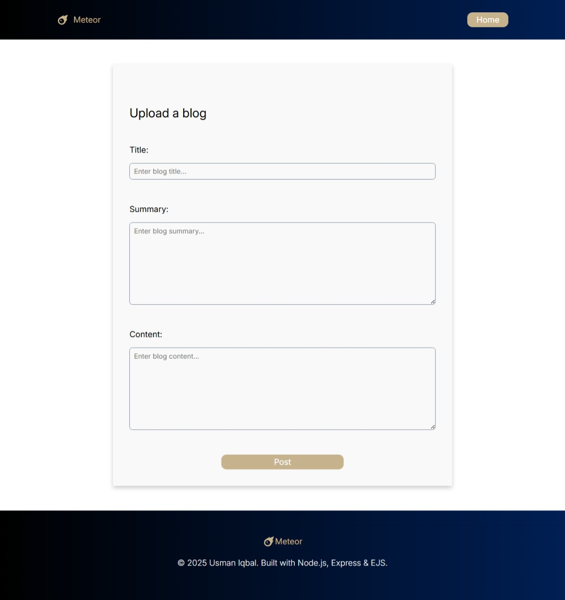
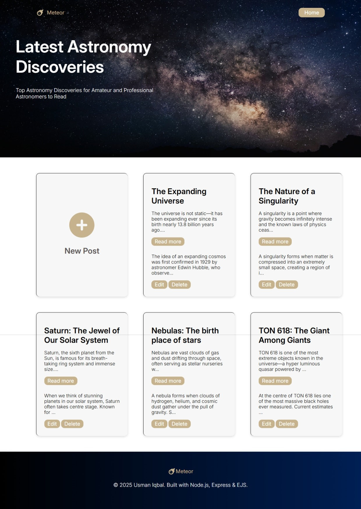
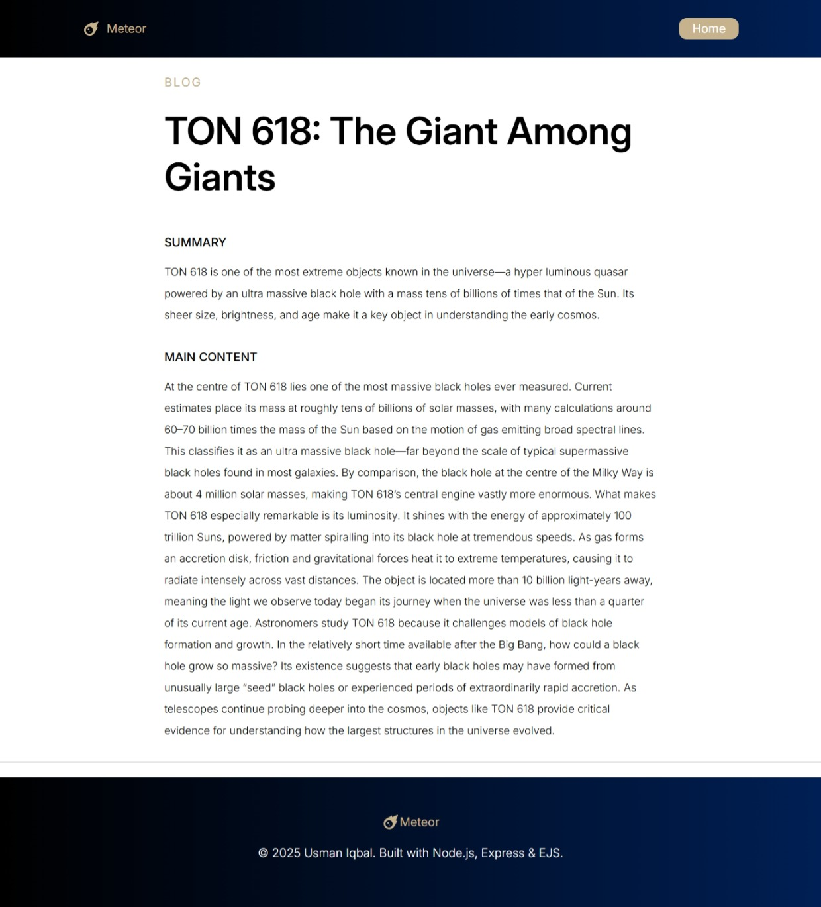

# Meteor - Astronomy Blog Application 🌠

## Overview 🌌

**Meteor** is a blog application where users can **create, read, update, and delete (CRUD)** posts about **astronomy**. Whether you're sharing the latest discoveries like **TON 618** or exploring celestial phenomena, Meteor allows users to engage in space-related topics, learn about astronomy and upload their own blogs about the universe.

Built with **Express** for the backend, **EJS** for rendering views, and **PostgreSQL** for storing posts, this app allows users to dive into the wonders of space using easy-to-manage blog functionality.

### Key Features ✨

- **View All Blogs**: Display a list of all astronomy-related blog posts 🌠
- **View Full Blog**: Read the full content of individual posts 🪐
- **Add Blog**: Add new posts with exciting astronomical content 📝
- **Edit Blog**: Update existing posts as new discoveries are made 🔄
- **Delete Blog**: Remove blog posts you no longer need 🗑️

---

## Technologies Used ⚙️

**Frontend**  
- HTML5  
- CSS3  
- JavaScript  

**Backend**  
- Node.js  
- Express.js – handles RESTful routing and server logic 
- EJS (Embedded JavaScript Templates) – server-side rendering of dynamic pages  

**Database**  
- PostgreSQL — stores blog titles, summaries, and main content.

---

## Installation 🛠️

### Prerequisites 🔑

Make sure you have **Node.js** and **PostgreSQL** installed on your machine before starting the application.

### Steps to Run Meteor 🌠

1. **Clone the Repository**:

    ```bash
    git clone https://github.com/Usman-Iqbal-5/Meteor_blog.git
    cd Meteor_blog
    ```

2. **Install Dependencies**:

    Install the necessary packages:

    ```bash
    npm install
    ```

3. **Set up PostgreSQL Database**:

    - Create a PostgreSQL database named `meteor_db` (or another name you prefer) 🎲.
    - Create a `blog_posts` table to store posts:

    ```sql
    CREATE TABLE IF NOT EXISTS blog_posts (
        blog_id SERIAL PRIMARY KEY,
        title TEXT NOT NULL,
        summary TEXT NOT NULL,
        main_content TEXT NOT NULL
    );
    ```

4. **Configure Your Database Connection**:

    Meteor uses **environment variables** to connect to the database. Create an `.env` file and set the following variables:

    ```env
    DB_USER=your_db_user
    DB_HOST=localhost
    DB_DATABASE=meteor_db
    DB_PASSWORD=your_db_password
    DB_PORT=5432
    ```

5. **Run the Application**:

    After setting up the database and environment variables, start the application by running:

    ```bash
    node server.js
    ```

    The app will be available at `http://localhost:3000` 🌍

---

## Screenshots 📸

Here are some screenshots of the application:


*Form to upload new blog post.*


*Home page to view all blog posts.*


*Full blog Blog article page.*

---


## License 📝

This project is licensed under the MIT License. See the [LICENSE](LICENSE) file for more details.

---
